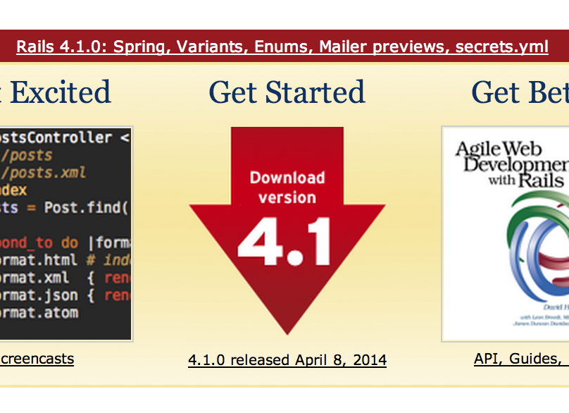

# Upgrading Rails? It is a good time to refactor your code
author
:   P.S.V.R

allotted-time
:   10m

theme
:   lightning-simple

# Rails 4.1 was released last week!

{:relative_height='80' reflect_ratio='0.5'}

# Why is it a good time to refactor your code? (1)

* if you have time for upgrading, you have time for refactoring

# Why is it a good time to refactor your code? (2)

    default_scope { where state: 'pending' }
    scope :active, -> { where state: 'active' }
    # versus
    scope :active, -> { unscope(where: :state).where(state: 'active') }
{: lang="ruby"}

* some upgraded behaviors require refactoring after all

# Why is it a good time to refactor your code? (3)

    enum status: [ :active, :archived ]
{: lang="ruby"}

* You wan to implement old functions via new features

# Roadmap

* Community Guidelines
* Code coverage
* Dependencies updating
* Density of Comments
* Cyclomatic complexity
* Static code analyzer

# Community Guidelines
* ruby-style-guide
* A community-driven Ruby coding style guide
* https://github.com/bbatsov/ruby-style-guide

# Code coverage (1)
* simplecov

# Code coverage (2)

* coveralls.io
* https://coveralls.io/
* gem 'coveralls', require: false

# Dependencies updating
* gemnasium
* https://gemnasium.com/

# Density of Comments (1)

$$
$DC = \frac{CLOC}{LOC}$
$$

* cf. http://staff.unak.is/andy/StaticAnalysis0809/metrics/dc.html

# Density of Comments (2)
* inch-pages
* https://github.com/rrrene/inch-pages

# Cyclomatic complexity
* developed by Thomas J. McCabe, Sr. in 1976

# Static code analyzer (1)
* rubocop
* gem install rubocop

# Download the slides

{:width='440' height='358'}
