# Upgrading Rails? It is a good time to refactor your code
author
:   P.S.V.R

allotted-time
:   20m

theme
:   lightning-simple

# Rails 4.1 was released last week!

{:relative_height='80' reflect_ratio='0.5'}

# Why is it a good time to refactor your code? (1)

* Trust me: if you had time for upgrading, you would have time for refactoring

# Why is it a good time to refactor your code? (2)

    default_scope { where state: 'pending' }
    scope :active, -> { where state: 'active' }
    # versus
    scope :active, -> { unscope(where: :state).where(state: 'active') }
{: lang="ruby"}

* some upgraded behaviors require refactoring after all

# Why is it a good time to refactor your code? (3)

    enum status: [ :active, :archived ]
    # implies
    instance.archived!
    instance.active? # => false
    instance.status  # => "archived"
    self.archived # => Relation for all archived Conversations
    self.statuses # => { "active" => 0, "archived" => 1 }
{: lang="ruby"}

* You wan to implement old functions via new features

# Roadmap

* Ⅰ. Community Guidelines
* Ⅱ. Code coverage
* Ⅲ. Dependencies updating
* Ⅳ. Density of Comments
* Ⅴ. Cyclomatic complexity
* Ⅵ. Static code analyzer
* Ⅶ. Commit messages

# Ⅰ. Community Guidelines (1)
* ruby-style-guide
* A community-driven Ruby coding style guide
* https://github.com/bbatsov/ruby-style-guide

# Ⅰ. Community Guidelines (2)

* ex. Comments section

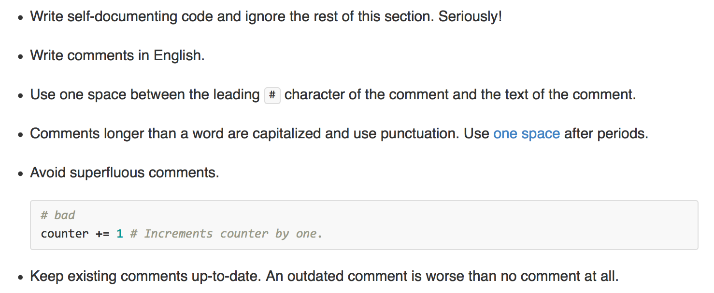{:relative_width='100'}

# Ⅰ. Community Guidelines (3)
* rails-style-guide
* A community-driven Rails 3 & 4 style guide
* https://github.com/bbatsov/rails-style-guide

# Ⅰ. Community Guidelines (4)

* ex. Routing section

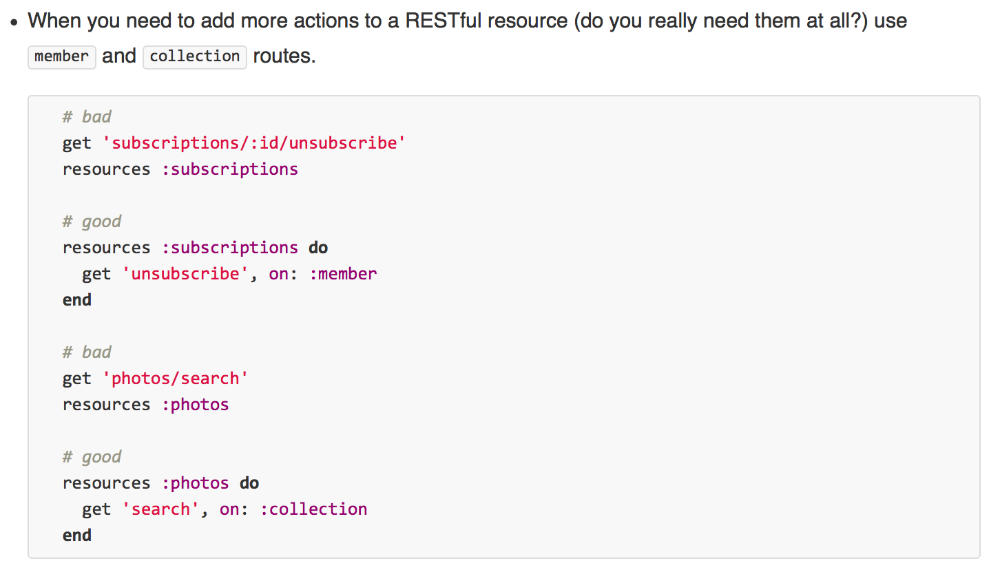{:relative_width='100'}

# Ⅱ. Code coverage (1)
* simplecov
* Code coverage for Ruby 1.9+ with a powerful configuration library and automatic merging of coverage across test suites
* gem install simplecov

# Ⅱ. Code coverage (2)
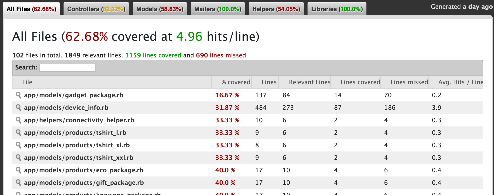{:relative_width='100'}

# Ⅱ. Code coverage (3)

* coveralls.io
* https://coveralls.io/
* gem 'coveralls', require: false

# Ⅱ. Code coverage (4)
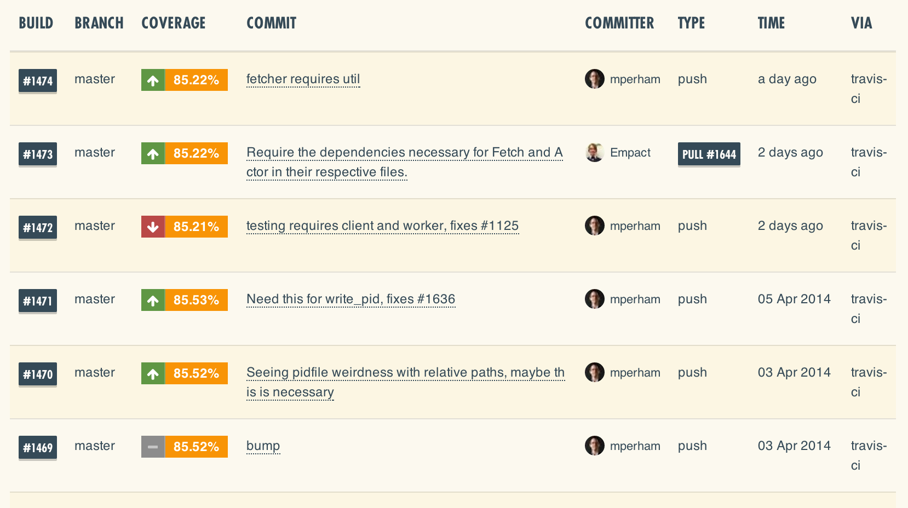{:relative_width='100'}

# Ⅲ. Dependencies updating (1)
* gemnasium
* https://gemnasium.com/

# Ⅲ. Dependencies updating (2)
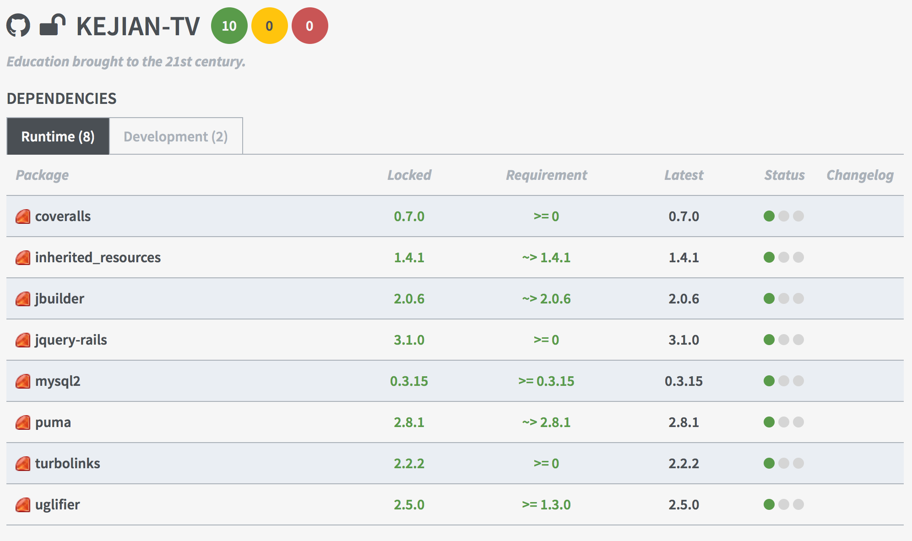{:relative_width='100'}

# Ⅳ. Density of Comments (1)

$$
$DC = \frac{CLOC}{LOC}$
$$

* cf. http://staff.unak.is/andy/StaticAnalysis0809/metrics/dc.html

# Ⅳ. Density of Comments (2)
* inch
* Documentation measurement tool for Ruby, based on YARD.
* gem install inch

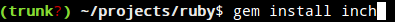{:relative_width='100'}

# Ⅳ. Density of Comments (3)
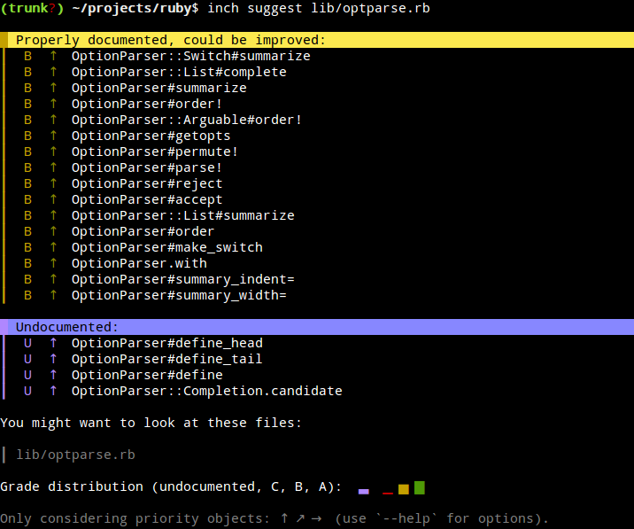{:relative_width='100'}

# Ⅳ. Density of Comments (4)
* inch-pages
* https://github.com/rrrene/inch-pages

# Ⅳ. Density of Comments (5)
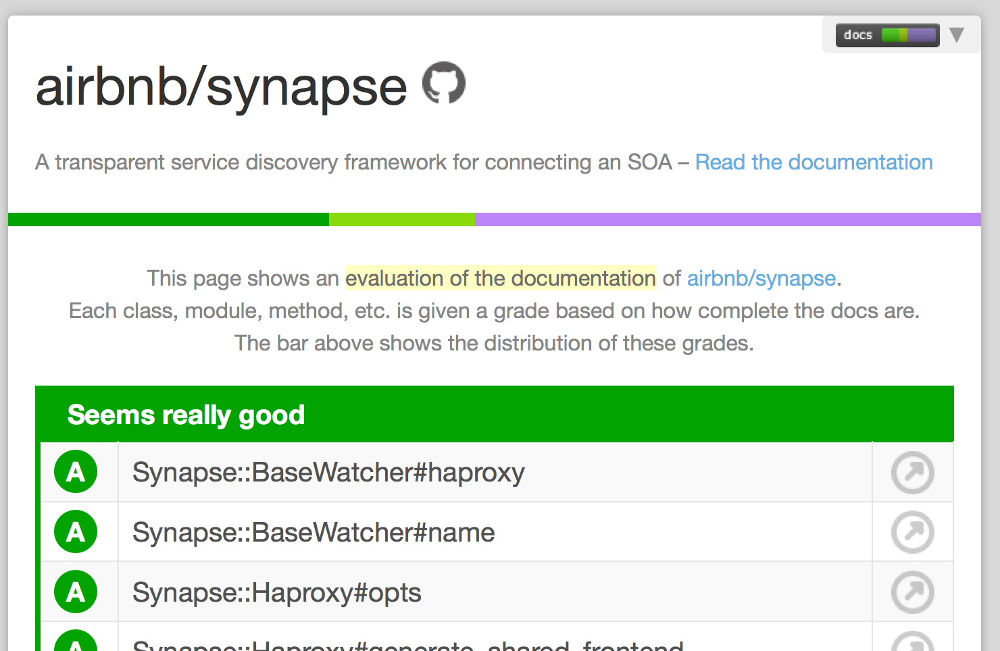{:relative_width='100'}

# Ⅴ. Cyclomatic complexity (1)
* developed by Thomas J. McCabe, Sr. in 1976
* For this strongly connected control flow graph, Cyclomatic complexity = 3 is the number of linearly independent cycles that exist in the graph, i.e. those cycles that do not contain other cycles within themselves.

# Ⅴ. Cyclomatic complexity (2)
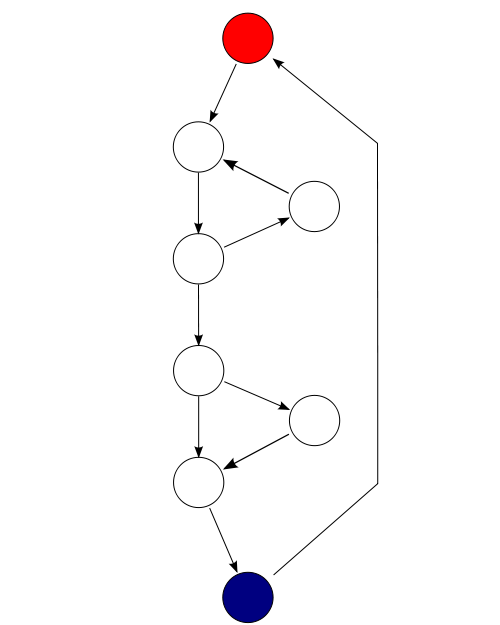{:relative_height='100'}

# Ⅴ. Cyclomatic complexity (3)

    def foo
      puts "hi"
    end
{: lang="ruby"}

* ex. Cyclomatic complexity = 1

# Ⅴ. Cyclomatic complexity (4)

    def foo(condition)
      puts "hi" if condition
    end
{: lang="ruby"}

* ex. Cyclomatic complexity = 2

# Ⅴ. Cyclomatic complexity (5)

    def foo(condition1, condition2)
      puts "hi" if condition1 or condition2
    end
{: lang="ruby"}

* ex. Cyclomatic complexity = 3

# Ⅴ. Cyclomatic complexity (6)

    def foo(day)
      case day
        when 'Monday';puts "Monday"
        when 'Tuesday';puts "Tuesday"
        when 'Wednesday';puts "Wednesday"
        when 'Thursday';puts "Thursday"
        when 'Friday';puts "Friday"
        when 'Saturday';puts "Saturday"
        when 'Sunday';puts "Sunday"
      end
    end
{: lang="ruby"}

* ex. Cyclomatic complexity = 8

# Ⅴ. Cyclomatic complexity (7 - before)

    before_filter :set_pv_uv
    def set_pv_uv
      return true if '/bots_delayed_job'==request.fullpath ||
        '/bots_pglog'==request.fullpath ||
        '/bots_alarms'==request.fullpath
      if !request.local? &&
        (!user_signed_in? || !current_user.admin?)
        PageView.create!(
          method: request.method,
          fullpath: request.fullpath,
          format: request.format.to_s,
          user_signed_in: (user_signed_in?),
          visitor: (user_signed_in? ?
              current_user.id.to_s : request.remote_ip),
          remote_ip: request.remote_ip,
          params: (request.get? ? nil :
            ActionDispatch::Http::ParameterFilter.new(
              Rails.application.config.filter_parameters).filter(
                params).to_json)
        )
      end
      return true
    end
{: lang="ruby"}

# Ⅴ. Cyclomatic complexity (8 - after)

    before_action :record_pv_uv, if: :record_pv_uv_needed?
{: lang="ruby"}

    def record_pv_uv_needed?
      !IGNORED_PAGE_VIEW_PATHS.include?(request.fullpath) &&
      !request.local? &&
      (!user_signed_in? || !current_user.admin?)
    end
{: lang="ruby"}

# Ⅴ. Cyclomatic complexity (9 - after)

    def record_pv_uv
      PageView.create!(
        method: request.method,
        fullpath: request.get? ? request.fullpath : request.path,
        format: request.format.to_s,
        user_signed_in: (user_signed_in?),
        visitor: (user_signed_in? ? current_user.id.to_s : request.remote_ip),
        remote_ip: request.remote_ip,
        params: (request.get? ? nil : filter_parameters.to_json)
      )
      true
    end
{: lang="ruby"}

# Ⅵ. Static code analyzer (1)
* rubocop
* gem install rubocop
* rubocop -R > rubocop.txt

# Ⅵ. Static code analyzer (2)
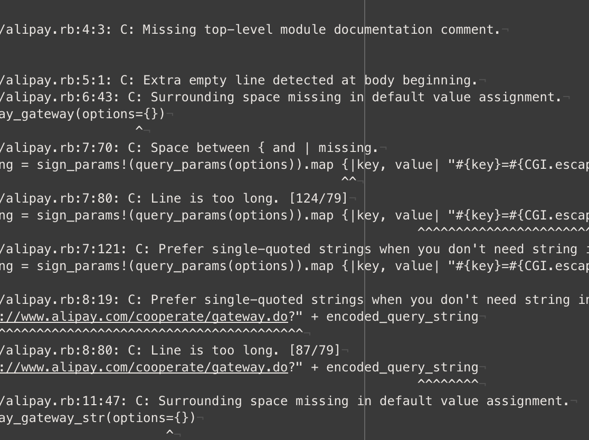{:relative_width='100'}

# Ⅵ. Static code analyzer (3)
* codeclimate
* https://codeclimate.com/

# Ⅵ. Static code analyzer (4)
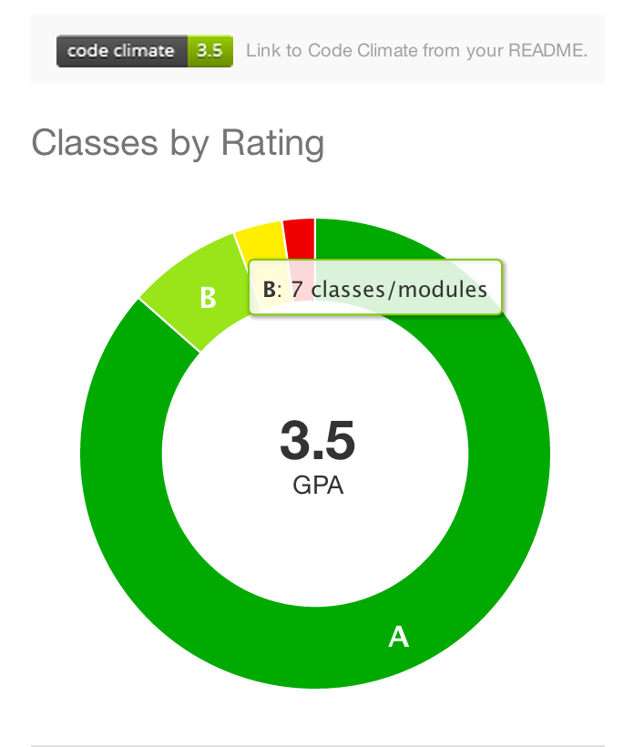{:relative_width='80'}

# Ⅶ. Commit messages (1)
* good commit message example

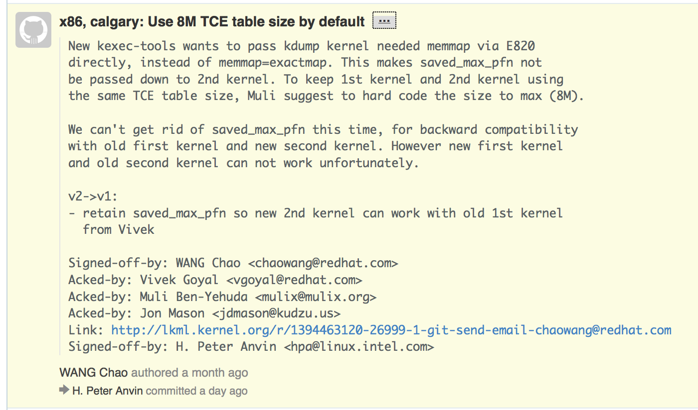{:relative_width='100'}

# Ⅶ. Commit messages (2)
* bad commit message examples

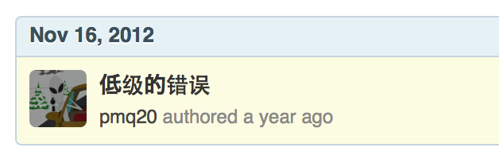{:relative_width='100'}

# Ⅶ. Commit messages (3)
* bad commit message examples

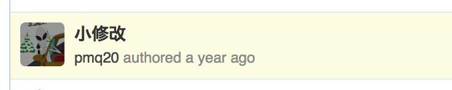{:relative_width='100'}

# Ⅶ. Commit messages (4)
* bad commit message examples

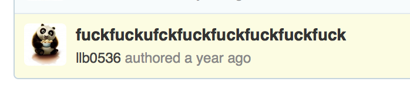{:relative_width='100'}

# How to write good commit messages?
* Use English
* Use the imperative, present tense: "change", not "changed" or "changes"; "Fix bug#1234" is better than "Fixed bug #1234"
* Use 50-char title and Use 72-character columns for word-wrapping.
* Read more: https://github.com/torvalds/linux/pull/17#issuecomment-5654674

# Download the slides

{:width='440' height='358'}
